## Writeup Template

### You can use this file as a template for your writeup if you want to submit it as a markdown file, but feel free to use some other method and submit a pdf if you prefer.

---

**Advanced Lane Finding Project**

The goals / steps of this project are the following:

* Compute the camera calibration matrix and distortion coefficients given a set of chessboard images.
* Apply a distortion correction to raw images.
* Use color transforms, gradients, etc., to create a thresholded binary image.
* Apply a perspective transform to rectify binary image ("birds-eye view").
* Detect lane pixels and fit to find the lane boundary.
* Determine the curvature of the lane and vehicle position with respect to center.
* Warp the detected lane boundaries back onto the original image.
* Output visual display of the lane boundaries and numerical estimation of lane curvature and vehicle position.


## [Rubric](https://review.udacity.com/#!/rubrics/571/view) Points

### Here I will consider the rubric points individually and describe how I addressed each point in my implementation.  

---

### Writeup / README

#### 1. Provide a Writeup / README that includes all the rubric points and how you addressed each one.  You can submit your writeup as markdown or pdf.  [Here](https://github.com/udacity/CarND-Advanced-Lane-Lines/blob/master/writeup_template.md) is a template writeup for this project you can use as a guide and a starting point.  

You're reading it!

### Camera Calibration

#### 1. Briefly state how you computed the camera matrix and distortion coefficients. Provide an example of a distortion corrected calibration image.

The code for this step is contained in the second and third code cell under the heading "Camera Calibration" of the jupyter-notebook titled `P2.ipynb` located in the CarND-Advanced-Lane-Lines repository. 

I used two helper functions to achieve this task described in the second cell, namely `calibrate_camera` and `correct_for_distortion`. In the next cell I start by defining the number of corners in x and y direction in the image. As suggested in the project statement I use the values 9 and 6 for x and y direction respectively. Then I prepare "object points" which will be the (x, y, z) coordinates of the chessboard corners in the real world. Assuming the chessboard is fixed on the (x,y) plane, I can put the z variable to be '0' such that the object points are the same for each calibration image. Thus, `objp` is just a replicated array of coordinates, and `obj_points` will be appended with a copy of it every time I successfully detect all chessboard corners in a test image.  `img_points` will be appended with the (x, y) pixel position of each of the corners in the image plane with each successful chessboard detection.  

After obtainig the `img_points` and `obj_points`, I use the helper function `calibrate_camera` to get the camera matrix (mtx) and the distortion coefficient (dist). I apply this distortion correction to the image using the `correct_for_distortion` function to obtain the undistorted image. A sample result in included in the writeup below:

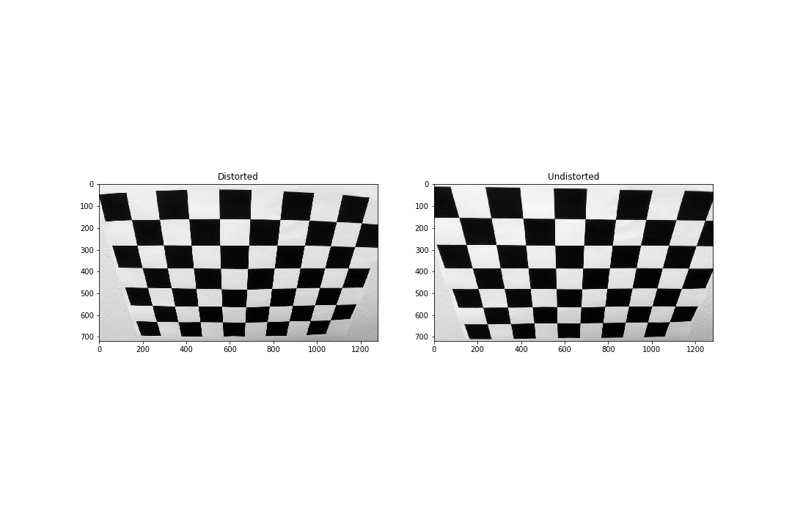
Fig. Image after correcting for distortion using the distortion coefficients obtained from camera calibration method in opencv.

### Pipeline (single images)

#### 1. Provide an example of a distortion-corrected image.

I used the same coefficients for applying distortion correction to the test images. An example is shown below:
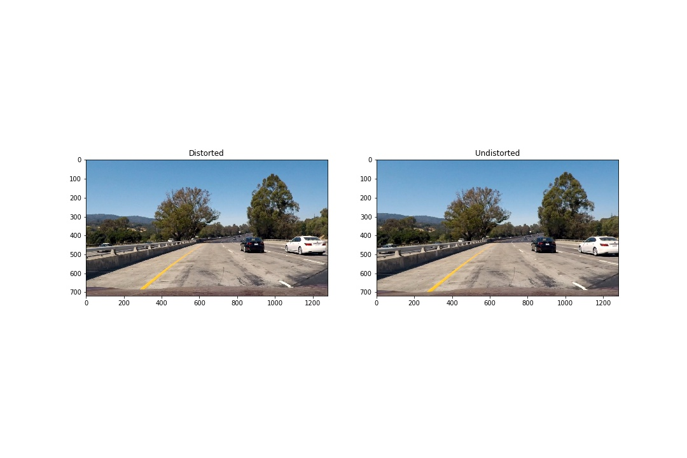
Fig. Distortion correction applied to the test image 1.

#### 2. Describe how (and identify where in your code) you used color transforms, gradients or other methods to create a thresholded binary image.  Provide an example of a binary image result.

In the same jupyter-notebook (P2.ipynb), I implemented the color transform and gradient under the heading "Color transform and gradient". I have implemented this using the helper functions `abs_sobel_thresh`,`mag_thresh`,`direc_thresh`,`S_thresh` to obtain sobel_x_binary, sobel_y_binary, magnitude_binary, directional_binary, hls_s_binary images respectively.

After obtaining all the binary images, I combine them together using the `combined_threshold` function as shown in the images below:
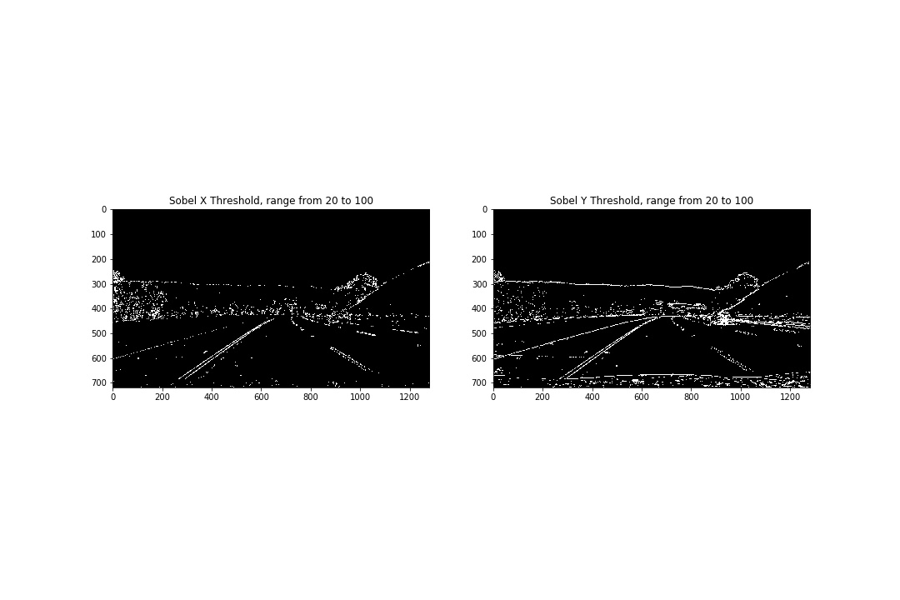
Fig. Sobel X (left) and Sobel Y (right) gradient thresholded binary image using the threshold range of 20 to 100. 
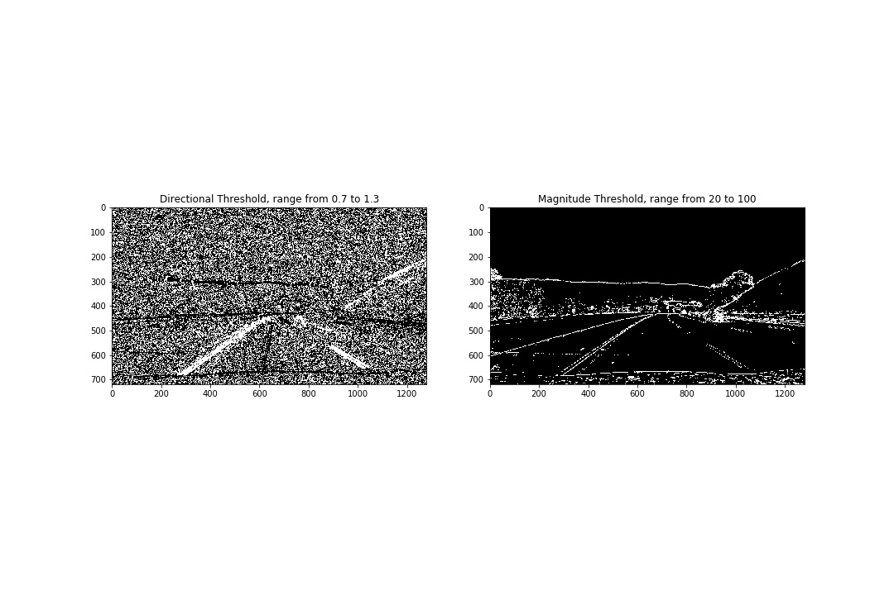
Fig. Directional (left) and Magnitudinal (right) gradient threshold binary image using threshold range of (0.7,1.3) for directional and (20,100) for magnitudinal gradient. 
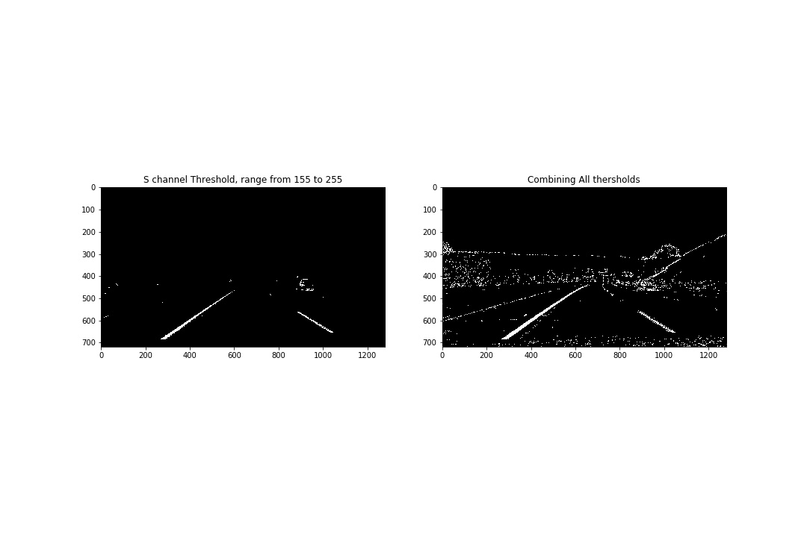
Fig. Image transformed to HLS color space and a S channel thresholded binary image using the range (155,255) on the left and then combining all the binary images (right).

I also played around with `region_of_interest` function to focus only on the region likely to contain the lane lines [just like in project 1](https://github.com/aakashkardam/Finding_Lane_Lines_Udacity_Project_1). I use the following coordinates for the region masking.
```python
vertices=np.array([[(550,470),
                      (760,470),
                      (1150,720),
                      (200,720)]], dtype=np.int32) 
    masked_image = region_of_interest(COMBINE_with_HLS_THRESH, vertices) # masked image obtained
```
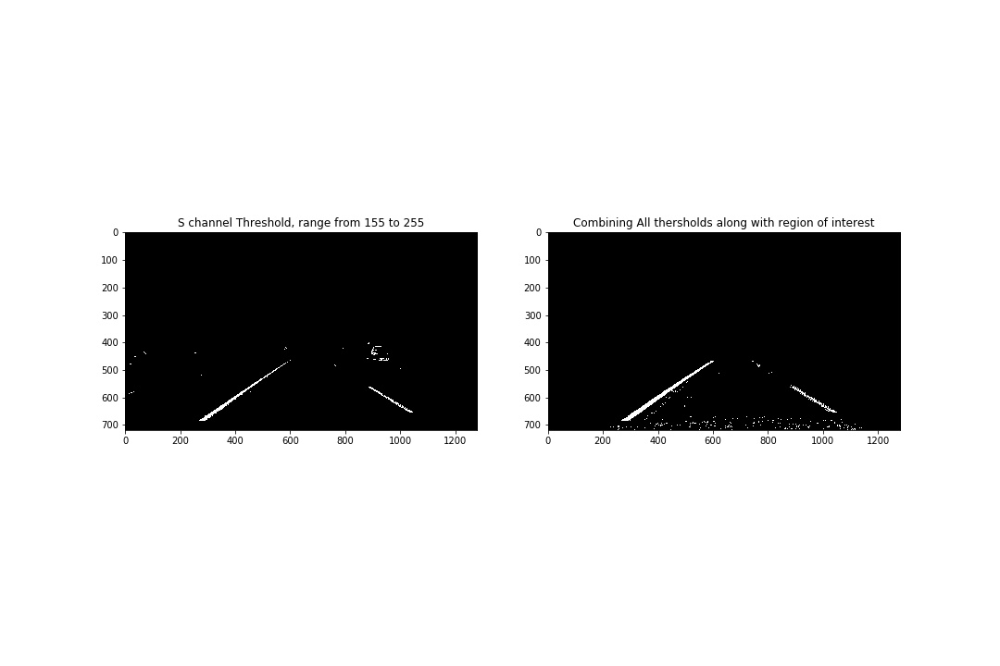
Fig. Experimenting with region of interest (masking) and combining all thresholded binary images together

I use the combination of all the thresholds for my further analysis.

#### 3. Describe how (and identify where in your code) you performed a perspective transform and provide an example of a transformed image.

The perspective transform is implemented under the heading "Next we do perspective transform" in P2.ipynb. The code for my perspective transform includes a helper function called `perspective_transform`, which makes use of the `getPerspectiveTransform`and`warpPerspective` in opencv. The `perspective_transform` function takes as inputs an image (`i`), uses source (`src`) and destination (`dst`) points to do the transform.  I chose the hardcode the source and destination points in the following manner:

```python
src = np.float32(
    [[(img_size[0] / 2) - 55, img_size[1] / 2 + 100],
    [((img_size[0] / 6) - 10), img_size[1]],
    [(img_size[0] * 5 / 6) + 60, img_size[1]],
    [(img_size[0] / 2 + 55), img_size[1] / 2 + 100]])
dst = np.float32(
    [[(img_size[0] / 4), 0],
    [(img_size[0] / 4), img_size[1]],
    [(img_size[0] * 3 / 4), img_size[1]],
    [(img_size[0] * 3 / 4), 0]])
```

This resulted in the following source and destination points:

| Source        | Destination   | 
|:-------------:|:-------------:| 
| 585, 460      | 320, 0        | 
| 203, 720      | 320, 720      |
| 1127, 720     | 960, 720      |
| 695, 460      | 960, 0        |

The warped image is shown below:

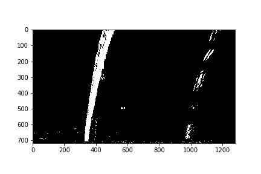

Fig. Warped Binary Image

I verified that my perspective transform was working as expected by plotting the warped and the original image together using the `src` and `dst` points above to verify that the lines appear parallel in the warped image.

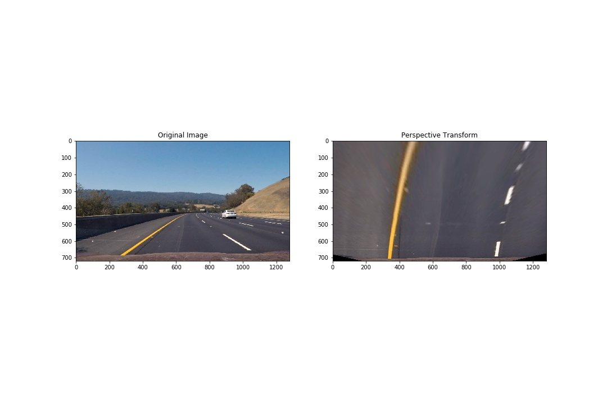
Fig. Original Image(left) and the warped image using perspective transform (right).

#### 4. Describe how (and identify where in your code) you identified lane-line pixels and fit their positions with a polynomial?

After perspective transform, the next step is to locate the pixels in the image that form the lane lines. This is achieved in a number of steps. First I plotted the histogram(of only lower half) of the `binary_warped_image` obtained in the previous step to find the base locations for the right and the left lane. The two peaks in the histogram respectively gives the left and the right lane starting positions at the bottom of the image.

After finding the starting position. I used the recommended "Sliding Window" method in order to locate the pixels that form the lane lines. In this method, I use a window centered around the starting positions found by the histogram peaks and with a margin of 100 pixels on either side and a specified window height of `image_shape[0]/9`. I count the number of activated pixels (white pixels in the image) in the window and if it is greater than a specified amount of `minipix` (minimum no. of pixels), I take the mean of the x locations of the pixels in that window to position the lane lines. I traverse from the bottom of the image to the top of the image with the same window size and update the position of the lines based on the activated pixels I see. Everytime appending these pixels in the separate lists for the left and thr right lane lines. This procedure is shown below where the green rectangles specify the windows used for search the pixels.

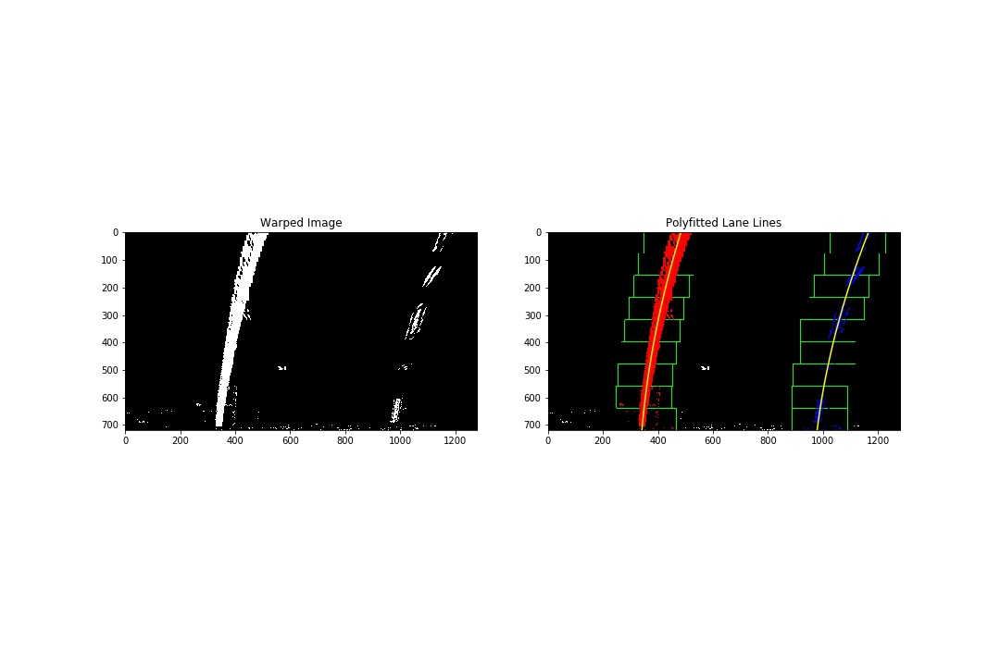
Fig. Polynomial of degree 2 fitted to show the lane lines detected based on pixels found using the sliding window method.

The implementation of the method described above is done through two helper functions, namely `hist` and `find_lane_line_pixels` which accepts an image `i` and is implemented in the code cell under the headings "Histogram: Finding the base location of the lane lines in the image" and "Sliding Window: To find the pixels that form the lane lines".

Once I have collected the pixels that form the two lane lines. I use a 2nd order polynomial fit using `fit_poly` function. Another image is shown below which uses the lane lines jsut after the polynomial fit to the activated pixesl obtained in the first sliding window and then searching around the lane lines which is in some sense a more informed search rather than repeating the whole process again.

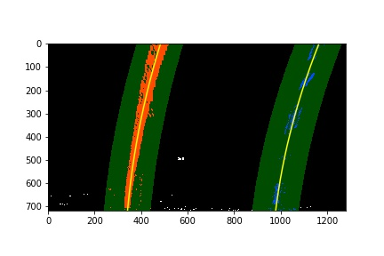

Fig. Lane Lines detected without repeating the sliding window method.

#### 5. Describe how (and identify where in your code) you calculated the radius of curvature of the lane and the position of the vehicle with respect to center.

After detecting the lane lines. The next step is to find the radius of curvature of the lines and find the location of the vehicle/car with respect to the lane lines. This is implemented under the headings "Radius of Curvature : Pixel Radius" and "Radius of Curvature : Real Radius".

I used [this link](https://www.intmath.com/applications-differentiation/8-radius-curvature.php) to compute the radius of curvature. Essentially what is required here is to use the expression directly and fill in the required values for `y_Eval` (which is the y co-ordinate of the location you want to know the curvature at). I have use the value to be the y value at bottom of the image. This is implemented in both `measure_curvature_pixels` and`measure_curvature_real` with the difference being the former gives you the radius values in pixels while the latter gives you the radius values in meters. I use a conversion factor of meters per pixel in x and y direction as recommended in the lecture and also described below.
```python
ym_per_pix = 30/720 # meters per pixel in y dimension
xm_per_pix = 3.7/700 # meters per pixel in x dimension
```
Up untill this point, we have the location of the lane lines in the entire image, the radius of curvature of the lane lines at the bottom of the image. USing these values we can compute the position of the car by taking the average of the positions of the lane lines and call it `lane_center_bottom_in_pixels` for pixel values and `lane_center_bottom_in_meters` for real values. If this value is less than `0` the vehicle/car is to the left and vice versa.

#### 6. Provide an example image of your result plotted back down onto the road such that the lane area is identified clearly.

I have implemented this step in the code cell under the heading "Displaying back on the image"  and I also wrote another helper function under the heading "Pipeline for a single image" as `process_image` which takes in an image `img` and applies the whole process we have discussed so far to produces a final output image. Here is an example of my result on a test image:

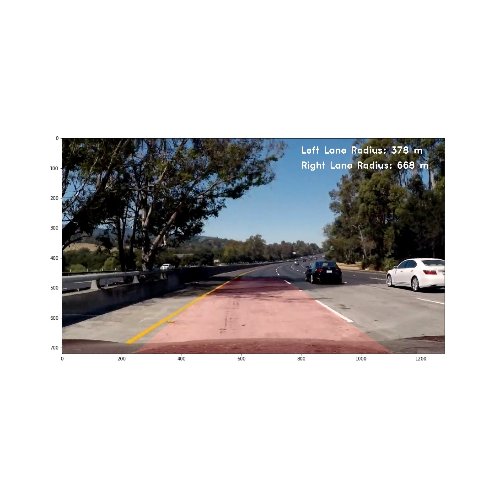

---

### Pipeline (video)

#### 1. Provide a link to your final video output.  Your pipeline should perform reasonably well on the entire project video (wobbly lines are ok but no catastrophic failures that would cause the car to drive off the road!).

Here's a [link to my video result](./output_images/project_video_output.mp4)


---

### Discussion

#### 1. Briefly discuss any problems / issues you faced in your implementation of this project.  Where will your pipeline likely fail?  What could you do to make it more robust?

Here I'll talk about the approach I took, what techniques I used, what worked and why, where the pipeline might fail and how I might improve it if I were going to pursue this project further.  

Every step of the process is important but in particular to be able to adress the challenging videos in the project and detect lane lines in them the step to generate the binary thresholded images requirea fine tuning. It requires involved work to find out the best thresholding range and the combination of the thresholds to use for the best result. I had used a variety of combinations to see what gives the best result. I would like to improve this step in order to detect the lane lines in the challenge videos.

During the step of polyfitting a polynomial. We collect the lane pixels that we found in the window. If the first window itself doesn't have any white pixels in it. The pipeline will likely fail, since the lane lines are often not continuous but broken. This can be addressed by imporoving the thresholding techniques to locate enough pixels in the first window when implementing the window search method. 

Also, the pipeline expects to find lines in every single frame of the video it processes. IF any frame doesn't have the lane lines, it might not work. The future improvements in the pipeline to counter this situation is to store the parameters that define the lane lines in the previous frames of the video and use them to generate lines in the frame which doesn't have any lane lines in it. Storing a moving average of the lane lines would be a good addition to the pipeline in the near future.

There can be small sanity check that can further improve the pipeline. For example a sanity check to confirm if the lane lines detected are not absurd and the values make sense in the real world. 

As such testing the pipeline with extreme cases would always provide good insights as to what can be improved.